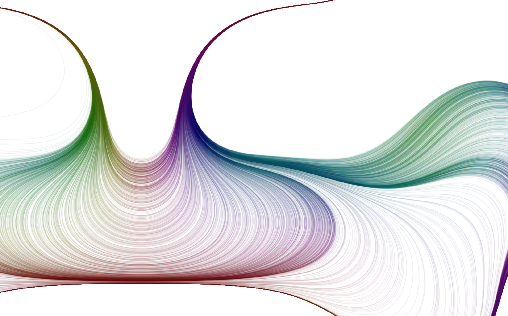

# Design Plan for Creative Coding Group Project

## Part I: Imaging Technique Inspiration

The imaging technique is ***curves*** that forms arbitrary shapes and their textures, and we plan to incorporate such designs of ***curves*** in our project. The inspiration comes from the following two figures. We choose them because ***curves*** can be used to enhance the beauty and visual appeal of an artwork, which are carefully designed to represent some dynamic objects and provide a sense of peace and tranquility.

## Part II: Coding Technique Exploration

We plan to use Javascript and p5.js to implement the imaging technique. More specifically, the coding techniques are as follows:

1. Create Perlin noise using p5.js.
2. Create an object with a sin/cos based broadline using the Javascript examples in Week5's tutorial.
3. Create the textures for the object with ***curves*** generated by sin/cos function and Perlin noise.

Below is the figure showing coding technique in action, and [this link](https://josephg.com/perlin/3/p.js) shows an example implementation.

